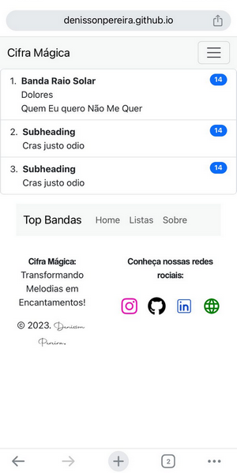
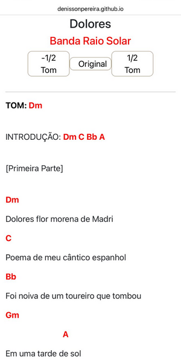

# 🎵 Cifra Mágica


# 🔍 Explore a Aplicação em Funcionamento

Convidamos você a explorar a aplicação **"Cifra Mágica"** em sua versão online: 

[](https://denissonpereira.github.io/Cifra-Magica/)

# 📑 Sobre o projeto 

O projeto **"Cifra Mágica"** é uma iniciativa inovadora no mundo da música, proporcionando uma plataforma online dedicada à disponibilização de cifras para músicos de todos os níveis de habilidade. O objetivo principal do **Cifra Mágica** é facilitar a vida dos músicos, oferecendo recursos como *rolagem automática*, ideal para apresentações ao vivo, onde a praticidade é essencial. Além disso, uma característica distintiva do projeto é sua capacidade de alterar a cifra para *subir ou baixar o tom*, garantindo que os usuários possam ajustar as músicas de acordo com suas preferências vocais.

## 📸 Visuals and Screenshots

Dê uma espiada nas imagens abaixo para ter uma prévia visual do projeto em ação. As capturas de tela oferecem um vislumbre das principais características e do design envolvente.

### 💻 Layout web
 

 

### 📱 Layout mobile
 

## 📚 Stack Tecnológica

[](https://vitejs.dev/)
[](https://react.dev/)
[](https://reactrouter.com/)
[](https://www.w3.org/html/)
[](https://sass-lang.com/)
[](https://developer.mozilla.org/en-US/docs/Web/JavaScript)
[](https://nodejs.org/)
[](https://react-bootstrap.netlify.app/)
[](https://react-icons.github.io/react-icons/)


## 🌐 Implantação em produção

- Web: `GitHub Pages`

# 🚀 Como executar o projeto 🚀

## ⚙ Pré-requisitos

Você precisa ter o npm instalado em seu computador. O npm está disponível com o NodeJS, e para baixá-lo, basta clicar no link abaixo:

[](https://nodejs.org/en) 

Após instalar o npm, instale as dependências do projeto com o seguinte comando no seu terminal:

```
npm install
```

## ✨ Tudo pronto! ✨

Agora basta executar o projeto com o comando:

```
npm run dev
```

Aguarde a conclusão da compilação e vá para http://localhost:5173/Cifra-Magica após o término da compilação.

>## 🚨 Aguarde! Ainda não terminou!

>O projeto está atualmente em desenvolvimento, e o ambiente aberto para contribuições de qualquer pessoa adiciona uma dimensão colaborativa e comunitária ao seu crescimento. Essa abertura para a participação externa não apenas enriquece o conteúdo disponível, mas também promove a diversidade musical, tornando o Cifra Mágica uma plataforma inclusiva para músicos de todos os estilos e origens. Com a combinação de praticidade, personalização e colaboração, o Cifra Mágica promete ser uma ferramenta valiosa e inspiradora para músicos em todo o mundo.

## 📜 Licença

Copyright (c) 2023 Denisson Pereira Santos.

[](https://github.com/DenissonPereira/Cifra-Magica/blob/main/LICENSE) 

## ✏️ Autor 

Denisson Pereira 

https://github.com/DenissonPereira